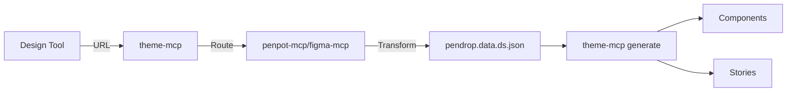
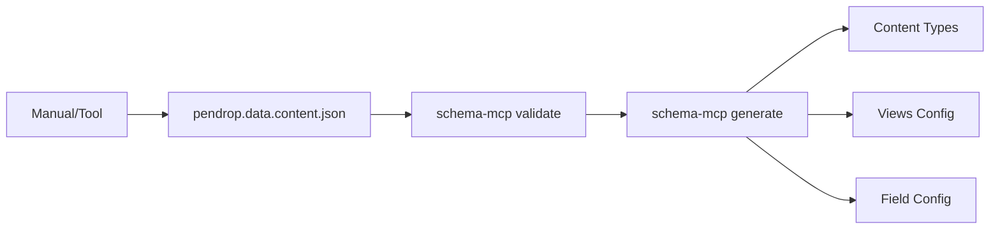

# Pendrop Architecture

This document provides a comprehensive overview of the Pendrop architecture, explaining how the AI-powered workflow orchestrates design system extraction and code generation.

## High-Level Overview

```
┌─────────────────┐         ┌─────────────────┐
│  Design Tools   │         │ Manual Creation │
│  (Penpot/Figma) │         │  (Content Def)  │
└────────┬────────┘         └────────┬────────┘
         │                           │
         ├──────────┐                │
         │          │                │
    ┌────▼─────┐ ┌──▼──────────┐    │
    │penpot-mcp│ │figma-mcp    │    │
    │          │ │  (future)   │    │
    └────┬─────┘ └──┬──────────┘    │
         │          │                │
         └──────────┤                │
                    │                │
           ┌────────▼────────┐       │
           │   theme-mcp     │       │
           │  (Bridge/Gen)   │       │
           └────────┬────────┘       │
                    │                │
        ┌───────────┴────────┐       │
        │                    │       │
  ┌─────▼──────┐      ┌──────▼──────┤
  │ pendrop.   │      │  pendrop.   │
  │ data.ds.   │      │  data.      │
  │ json       │      │  content.   │
  │            │      │  json       │
  └─────┬──────┘      └──────┬──────┘
        │                    │
        │  (Generation)      │
        │                    │
  ┌─────▼──────┐      ┌──────▼──────┐
  │ theme-mcp  │      │ schema-mcp  │
  │(generate)  │      │(generate)   │
  └─────┬──────┘      └──────┬──────┘
        │                    │
        ├─────────┬──────────┤
        │         │          │
   ┌────▼───┐ ┌──▼────┐ ┌───▼────┐
   │Compo-  │ │Stories│ │Drupal  │
   │nents   │ │       │ │Config  │
   └────────┘ └───────┘ └────────┘
```

## Core Components

### 1. Extraction MCPs (Tool-Specific)

#### penpot-mcp
- **Purpose**: Extract design data from Penpot
- **Input**: Penpot file URL or exported data
- **Output**: `pendrop.data.ds.json` (W3C DTCG format)
- **Responsibilities**:
  - Connect to Penpot API
  - Extract components and design tokens
  - Transform to pendrop schema format
  - Output standardized design system data

#### figma-mcp (Future)
- Similar to penpot-mcp but for Figma
- Will output the same `pendrop.data.ds.json` format

### 2. Generation MCPs (Tool-Agnostic)

#### theme-mcp (Bridge + Generator)
- **Purpose**: Single entry point for design system operations
- **Dual Role**:
  1. **Bridge**: Routes extraction to appropriate tool-specific MCP
  2. **Generator**: Generates components and stories

**Tools:**
- `extract_design(fileUrl)`: Routes to penpot-mcp/figma-mcp based on URL
- `generate_component(pendropDsData, componentId, target)`: Generate component code
- `generate_story(pendropDsData, componentId, target)`: Generate component story

**URL Routing:**
```typescript
detectDesignTool(fileUrl) {
  if (url.includes('penpot.com')) return 'penpot';
  if (url.includes('figma.com')) return 'figma';
  return 'unknown';
}
```

#### schema-mcp (Content Structure)
- **Purpose**: Generate CMS configuration from content structure
- **Input**: `pendrop.data.content.json`
- **Output**: Drupal configuration files

**Tools:**
- `generate_content_types(pendropContentData, target)`: Generate content type configs
- `generate_config(pendropContentData, target)`: Generate views and other config
- `validate_structure(data, schemaType)`: Validate against pendrop schemas

### 3. Data Files (Rules)

#### pendrop.data.ds.json
- **Schema**: `pendrop.schema.ds.json`
- **Contains**: Design system definition
  - `tokens`: Design tokens in W3C DTCG format
  - `components`: Component definitions with props
  - `stories`: Story/variant definitions
- **Role**: THE rules for component generation
- **Source**: Generated by extraction MCPs or manually created

#### pendrop.data.content.json
- **Schema**: `pendrop.schema.content.json`
- **Contains**: Content structure definition
  - `content`: Entity types, bundles, fields
  - `config`: Views and CMS configuration
- **Role**: THE rules for CMS configuration generation
- **Source**: Manually created or generated by other tools

### 4. Convention System

#### Convention Layers
```
Built-in Conventions (fallback)
    ↓
Target Conventions (rules/targets/drupal/)
    ↓
Project Conventions (project-specific)
    ↓
Final Merged Conventions
```

#### Convention Files
- **conventions.yaml**: Naming styles, paths, file structure
- **prompts.yaml**: AI generation prompts
- **story.yaml**: Story format configuration

#### Example: Drupal Conventions
```yaml
# rules/targets/drupal/conventions.yaml
naming:
  style: snake_case
  component_prefix: ""
paths:
  components: /components
  config: /config/sync
structure:
  component_files: [component.yml, template.twig]
drupal:
  component_namespace: custom
  schema_version: 1.0
```

## Workflows

### Design-System-Pipeline



**Steps:**
1. **AI calls** `theme-mcp.extract_design(penpotUrl)`
2. **theme-mcp routes** to penpot-mcp
3. **penpot-mcp** extracts and transforms to `pendrop.data.ds.json`
4. **AI calls** `theme-mcp.generate_component()` for each component
5. **AI calls** `theme-mcp.generate_story()` for each component
6. **Output**: Drupal SDC components + Storybook stories

### Content-/CMS-Pipeline



**Steps:**
1. **Create** `pendrop.data.content.json` (manually or via tools)
2. **AI calls** `schema-mcp.validate_structure()`
3. **AI calls** `schema-mcp.generate_content_types()`
4. **AI calls** `schema-mcp.generate_config()`
5. **Output**: Drupal configuration YAML files

## AI Integration

### How AI Uses MCP Servers

1. **AI analyzes** design file URL
2. **AI calls** `theme-mcp.extract_design(url)`
3. **AI reviews** resulting `pendrop.data.ds.json`
4. **AI iterates** over components
5. **AI calls** `generate_component()` and `generate_story()` for each
6. **AI reviews** content structure needs
7. **AI creates/loads** `pendrop.data.content.json`
8. **AI calls** schema-mcp tools to generate CMS config

### Convention-Based Generation

AI uses conventions to guide generation:

```javascript
// AI knows from conventions:
- Naming style (snake_case)
- File structure (component.yml + template.twig)
- Output paths (/components)
- Story format (Storybook with storybook-addon-sdc)

// AI generates code following conventions
generate_component({
  componentId: "button",
  target: "drupal",
  // Conventions loaded automatically
})
```

### AI Prompts

Conventions include AI prompts that guide generation:

```yaml
# rules/targets/drupal/prompts.yaml
generate_component: |
  Generate a Drupal SDC component with:
  1. component.yml with proper schema
  2. template.twig with BEM CSS classes
  3. Accessibility attributes
  4. Design token usage
  
  Component data: {component_data}
  Conventions: {conventions}
```

## Extensibility

### Adding New Design Tools

1. Create new extraction MCP (e.g., `sketch-mcp`)
2. Implement tools that output `pendrop.schema.ds.json` format
3. Update `theme-mcp` URL routing
4. Configure in `theme-mcp.config.json`

### Adding New Target Platforms

1. Create `rules/targets/{platform}/` directory
2. Add conventions.yaml, prompts.yaml, story.yaml
3. Define platform-specific conventions
4. MCP servers automatically support new target

### Project-Specific Customization

1. Create `my-project/rules/custom-conventions.yaml`
2. Override specific conventions
3. Configure MCP to use project rules
4. No code changes needed

## Technology Stack

- **MCP Servers**: TypeScript, Node.js
- **Protocol**: Model Context Protocol (MCP)
- **Schemas**: JSON Schema (Draft 07)
- **Conventions**: YAML
- **Tokens**: W3C Design Tokens Community Group (DTCG) format
- **Target**: Drupal 10+ (SDC, Configuration Management)
- **Stories**: Storybook with storybook-addon-sdc

## Design Decisions

See [Architecture Decision Records (ADRs)](ADR/) for detailed design decisions:

- [ADR 001: Theme MCP Bridge Pattern](ADR/001-theme-mcp-bridge-pattern.md)
- [ADR 002: Extraction Outputs Pendrop Format](ADR/002-extraction-outputs-pendrop-format.md)
- [ADR 003: Generic Story Concept](ADR/003-generic-story-concept.md)
- [ADR 004: Convention Layering](ADR/004-convention-layering.md)

## Future Enhancements

1. **Figma Support**: Complete figma-mcp implementation
2. **More Targets**: WordPress, Laravel, etc.
3. **Validation**: Schema validation in MCP servers
4. **Testing**: Automated testing for generated code
5. **CLI Tools**: Command-line interface for manual workflow
6. **UI**: Web interface for configuration and monitoring

